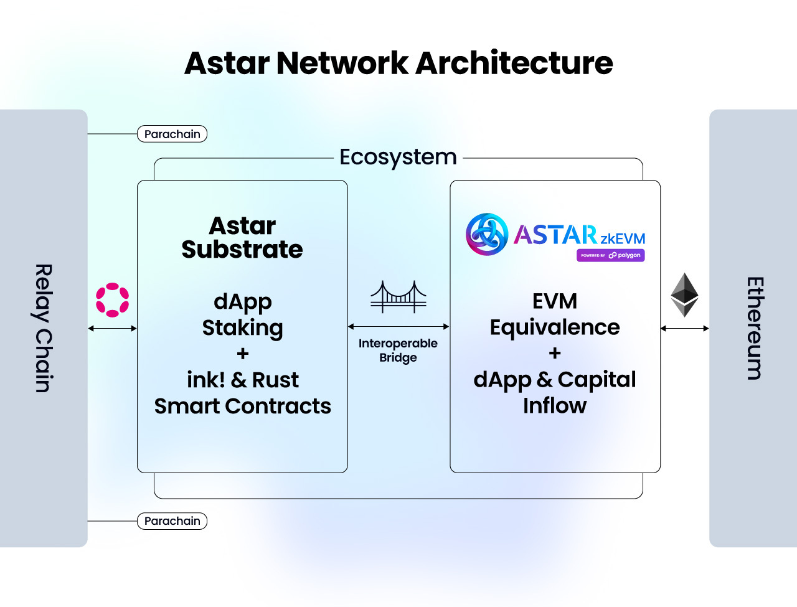

# Networks
## Overview

Prior to commencing development it's important to understand the Astar Network family, and choose an appropriate network to deploy on based on what you would like to do. Currently, there are a number of networks available, including the Local network which runs exclusively within your development environment. All networks support EVM RPCs, and Astar Parachain supports Substrate RPC as well.

## Local Networks

### Substrate Node
You can clone the Astar repository and run the local node provided, or download the precompiled binary and run it, instead. Both methods are described in the [Nodes](/docs/build/build-on-layer-1/nodes/index.md) section.

### Swanky Node

Swanky Node is a Substrate based blockchain configured to enable the smart contract module `pallet-contracts`, and other features that assist local development of Wasm smart contracts.
For more information about Swanky Node, check out the [Swanky Suite](https://docs.astar.network/docs/build/build-on-layer-1/smart-contracts/wasm/swanky-suite/) section. [INSERT PROPER LINK]

### Zombienet

With Zombienet users can download arbitrary Relay Chain and parachain binaries (or use images) to setup a configurable local test network. Users will have access to all privileged actions on the Relay Chain and parachains, which simplifies testing. For more information about Zombienet, check out the [Build Environment](/docs/build/build-on-layer-1/environment/zombienet-testing.md).

## Testnets

### Shibuya 

Shibuya has nearly the same chain specifications as Shiden & Astar, and provides an ideal environment for developers to test and debug, prior to launching their dApp on mainnet.
Shibuya is running as a parachain of the Tokio Relay Chain, which is managed internally by the Astar team, and supports Shibuya, only, as test parachain.

The Shibuya native token symbol is SBY.

To obtain test tokens from the faucet, please visit the Astar Portal and connect to Shibuya. If for any reason the faucet is empty, please contact the Astar team on Discord.

## Mainnets

Astar has three mainnets. One parachain on Kusama, One parachain on Polkadot, and a zkEVM-based network on Ethereum Layer 2.

### Shiden Substrate Network

Shiden is a parachain connected to the Kusama Relay Chain, and used to deploy and test new releases of Astar runtime in a live production (canary) environment. Shiden is not considered a testnet since SDN has its own tokenomics and value, but is used to validate and stabilize new software releases and upgrades for Astar Network.

The Shiden native token symbol is SDN.

### Astar Substrate Network
By now you may have guessed that Astar parachain is connected to Polkadot Relay chain.

The Astar native token symbol is ASTR.

